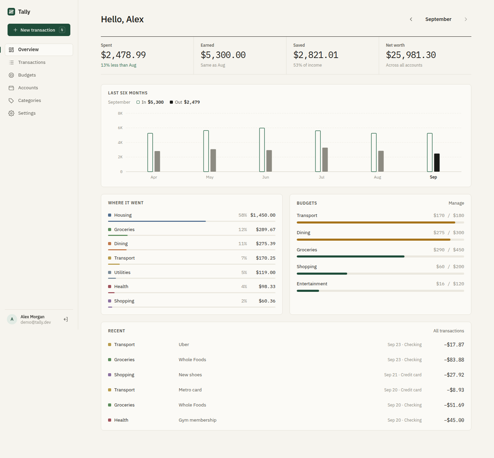
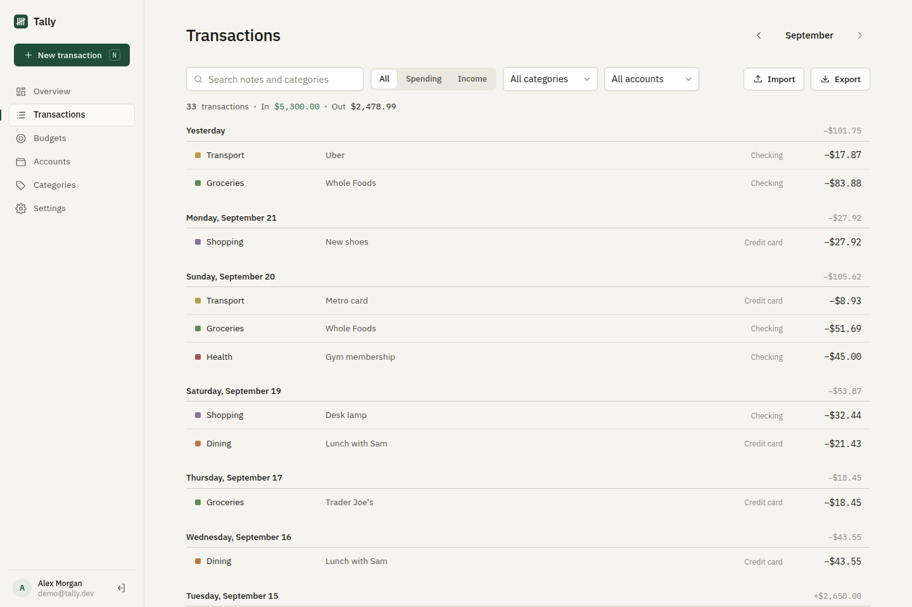
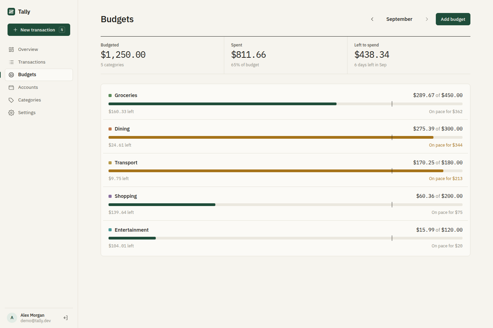
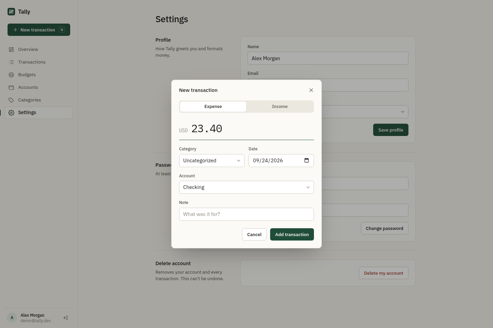
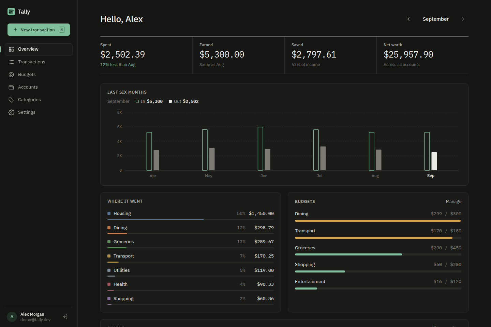
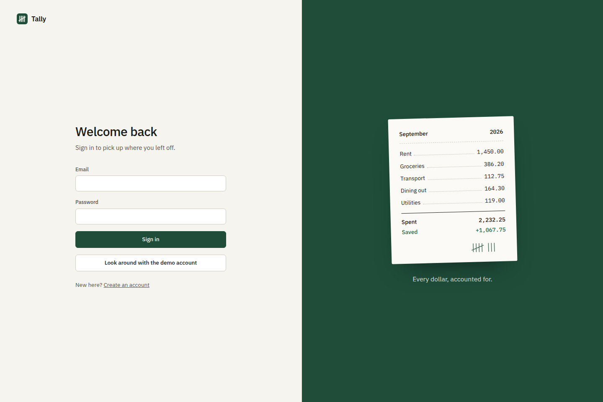
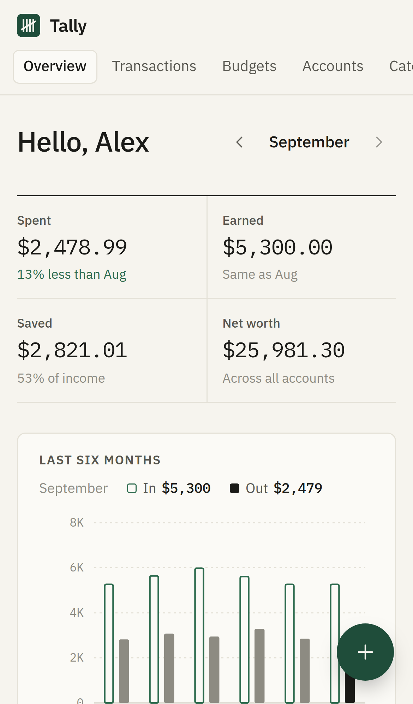

<p align="center">
  
</p>

<h1 align="center">Tally</h1>

<p align="center">
  A calm, private personal-finance app. Track spending, set budgets, see where your money goes.
  <br>
  <b>FastAPI · SQLAlchemy · React · TypeScript · TanStack Query</b>
</p>

<p align="center">
  <a href="https://github.com/AdelAd8l/tally/actions/workflows/ci.yml"></a>
  
  
  
</p>



## Features

- **Accounts.** Checking, savings, cash and credit cards, with live balances.
- **Transactions.** Add in two seconds (press <kbd>N</kbd> anywhere), grouped by day, with search and filters by type, category and account.
- **Monthly budgets.** Per-category limits with a "today" marker and an *on pace for* projection, so you see overspending coming before it happens.
- **Overview.** Spent, earned, saved and net worth, with month-over-month change, a six-month income vs. spending chart, and a category breakdown.
- **CSV import and export.** Bring in a bank export (negative amounts become expenses, unknown categories are created for you) or take your data anywhere.
- **Categories.** Your own spending and income categories, each with a color.
- **Accounts and security.** Email and password sign-up, bcrypt-hashed passwords, httpOnly session cookies, strict per-user data isolation, password change and account deletion.
- **Installable on your phone.** Web-app manifest, home-screen icon, safe-area aware layout and a floating add button. Follows the system dark mode.

<table>
  <tr>
    <td></td>
    <td></td>
  </tr>
  <tr>
    <td></td>
    <td></td>
  </tr>
  <tr>
    <td></td>
    <td align="center"></td>
  </tr>
</table>

## Quick start

### Docker (one command)

```bash
cp .env.example .env
echo "TALLY_SECRET_KEY=$(python3 -c 'import secrets; print(secrets.token_hex(32))')" >> .env
echo "TALLY_DEMO=true" >> .env          # optional: adds a demo account with 6 months of data
docker compose up --build
```

Open http://localhost:8000.

### Use it on your phone (free hosting)

Tally installs to your home screen like a native app: full screen, its own icon, no app store.

1. **Create a free Postgres database** on [Neon](https://neon.tech) and copy its connection string
   (`postgresql://...`). Render's free disk is wiped on every deploy, so the database keeps your data safe.
2. **Deploy:** click [**Deploy to Render**](https://render.com/deploy?repo=https://github.com/AdelAd8l/tally),
   sign in with GitHub, and paste the connection string into `TALLY_DATABASE_URL`.
   `render.yaml` sets up everything else, including a random secret key.
3. **Open your `…onrender.com` URL on your phone** and create your account.
4. **Close sign-ups:** in Render → *Environment*, set `TALLY_ALLOW_SIGNUP=false`, so nobody else can register.
5. **Install:**
   - **iPhone (Safari):** Share → *Add to Home Screen*
   - **Android (Chrome):** ⋮ menu → *Add to Home screen* / *Install app*

> Render's free plan sleeps after 15 minutes without traffic, so the first open after a break takes
> about 30–50 seconds. Your data isn't affected.

### Local development

Backend (Python 3.11+):

```bash
cd backend
python -m venv .venv && source .venv/bin/activate
pip install -r requirements-dev.txt
python -m app.seed                      # optional demo user: demo@tally.dev / demo-password
uvicorn app.main:app --reload           # http://localhost:8000/docs for the API
```

Frontend (Node 20+), in a second terminal:

```bash
cd frontend
npm install
npm run dev                             # http://localhost:5173 (proxies /api to :8000)
```

## How it's built

```
tally/
├── backend/
│   ├── app/
│   │   ├── main.py            FastAPI app; also serves the built frontend
│   │   ├── models.py          SQLAlchemy 2.0 models (money stored as integer cents)
│   │   ├── schemas.py         Pydantic request/response models
│   │   ├── security.py        bcrypt + JWT session cookie
│   │   ├── routers/           auth, accounts, categories, transactions, budgets, reports
│   │   └── seed.py            demo data generator
│   └── tests/                 pytest suite covering every endpoint
├── frontend/
│   └── src/
│       ├── lib/               typed API client, formatting, React Query hooks
│       ├── components/        layout, dialogs, hand-drawn SVG chart
│       └── pages/             Overview, Transactions, Budgets, Accounts, Categories, Settings
├── Dockerfile                 multi-stage: builds the React app, serves it from FastAPI
├── render.yaml                one-click deploy to Render
└── .github/workflows/ci.yml   lint + tests + build + docker image on every push
```

Some decisions worth calling out:

- **Money is integers.** Every amount is stored and sent as cents, so there's no floating-point drift. Formatting happens only at the edge with `Intl.NumberFormat`.
- **One origin, no CORS.** In production FastAPI serves the React build, so the session cookie can be `httpOnly` + `SameSite=Lax` and no token is ever exposed to JavaScript.
- **Ownership is checked on every row.** Every lookup goes through `get_owned()`, which returns 404 (never 403) for other users' data, so IDs can't be probed. Tests cover this.
- **No chart library.** The six-month chart is about 100 lines of SVG, sized to its container so labels stay crisp at any width.
- **Deleting is safe by default.** Accounts with history can't be deleted (`ON DELETE RESTRICT`). Deleting a category keeps its transactions as *Uncategorized* (`ON DELETE SET NULL`).

## API

Interactive docs are at `/docs` when the server is running. Main endpoints:

| Method | Path | |
|---|---|---|
| `POST` | `/api/auth/register`, `/api/auth/login`, `/api/auth/logout` | Session auth |
| `GET/PATCH/DELETE` | `/api/auth/me` | Profile |
| `GET/POST/PUT/DELETE` | `/api/accounts`, `/api/categories` | Setup |
| `GET/POST/PUT/DELETE` | `/api/transactions` | Filters: `start`, `end`, `q`, `kind`, `account_id`, `category_id`, `limit`, `offset` |
| `GET` / `POST` | `/api/transactions/export` / `/api/transactions/import` | CSV |
| `GET/PUT/DELETE` | `/api/budgets?month=YYYY-MM` | Budgets with spent-to-date |
| `GET` | `/api/reports/overview?month=`, `/api/reports/trend?end=&months=` | Reports |

## Configuration

| Variable | Default | |
|---|---|---|
| `TALLY_SECRET_KEY` | dev key | **Set this in production.** Signs session tokens. |
| `TALLY_DATABASE_URL` | `sqlite:///./tally.db` | SQLite or Postgres (`postgresql://…` URLs from Neon, Supabase, Render work as-is) |
| `TALLY_COOKIE_SECURE` | `false` | Set `true` behind HTTPS |
| `TALLY_DEMO` | `false` | Seed a demo account and show a demo button on sign-in |
| `TALLY_ALLOW_SIGNUP` | `true` | Set `false` to keep a personal server private |
| `TALLY_SESSION_DAYS` | `14` | Session length |

## Testing

```bash
cd backend && ruff check . && pytest
cd frontend && npm run lint && npm run build
```

## Roadmap

- Recurring transactions
- Transfers between accounts
- Alembic migrations
- Rate limiting on sign-in

## License

MIT © [AdelAd8l](https://github.com/AdelAd8l)
